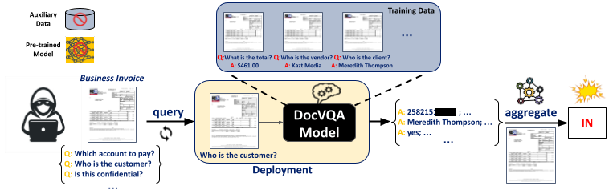

# DocVQA MIA

This is the code repository of the paper: "DocMIA: Document-Level Membership Inference Attacks against DocVQA Models".

[](http://arxiv.org/abs/2502.03692)
[](https://openreview.net/forum?id=gNxvs5pUdu)

## Abstract
Document Visual Question Answering (DocVQA) has introduced a new paradigm for end-to-end document understanding, and quickly became one of the standard benchmarks for multimodal LLMs. Automating document processing workflows, driven by DocVQA models, presents significant potential for many business sectors. However, documents tend to contain highly sensitive information, raising concerns about privacy risks associated with training such DocVQA models. One significant privacy vulnerability, exploited by the membership inference attack, is the possibility for an adversary to determine if a particular record was part of the model's training data. In this paper, we introduce two novel membership inference attacks tailored specifically to DocVQA models. These attacks are designed for two different adversarial scenarios: a white-box setting, where the attacker has full access to the model architecture and parameters, and a black-box setting, where only the model's outputs are available. Notably, our attacks assume the adversary lacks access to auxiliary datasets, which is more realistic in practice but also more challenging. Our unsupervised methods outperform existing state-of-the-art membership inference attacks across a variety of DocVQA models and datasets, demonstrating their effectiveness and highlighting the privacy risks in this domain.
<p align="center">
    
</p>

## Quick Start
- **Get code**
```shell 
git clone https://github.com/khanhnguyen21006/mia_docvqa.git
cd mia_docvqa
```

- **Set-up environment**

This code works in our local environment with `CUDA 11.3` and `NVIDIA A40/L40S GPUs`.
```shell
conda create -n docmia python=3.9.13 -y
conda activate docmia
conda install pytorch==1.11.0 torchvision==0.12.0 torchaudio==0.11.0 -c pytorch -y
pip install -r requirements.txt
pip install --no-deps git+https://github.com/huggingface/peft@894e68a
```

- **Prepare Data**

We use two DocVQA datasets: [DocVQA](https://rrc.cvc.uab.es/?ch=17) (Single Page) and [PFL-DocVQA](https://benchmarks.elsa-ai.eu/?ch=2). Please:

1. Follow the instructions on the official websites to download the data. Only *images* are required for this repo.
2. Maintain the folder structure for each dataset (named in lowercase) as followed:
```bash
└── DATA_ROOT
    └── docvqav0
        ├── spdocvqa_images.tar.gz
    └── pfl
        ├── images.zip
```

For the `imdb` files (which contain the question/answer/OCR data for the DocVQA task), we provide a preprocessed version from original data for both datasets, as each dataset has its own data format and structure. 

To download and convert it to an unified format for MIAs, run:
```shell
python download.py --root /path/to/DATA_ROOT
```

- **Download Model**

This repo has implementation of MIAs on the following models: [VT5](https://arxiv.org/abs/2312.10108), [Donut](https://arxiv.org/abs/2111.15664), [Pix2Struct](https://arxiv.org/abs/2210.03347), [UDOP](https://arxiv.org/abs/2212.02623), and [LayoutLMv3](https://arxiv.org/abs/2204.08387).

Most model checkpoints used in our experiments are hosted on [HuggingFace](https://huggingface.co/). For `VT5` and `Donut` checkpoints fine-tuned on `PFL-DocVQA` (which are not publicly available on HuggingFace), we provide our own fine-tuned versions that achieve competitive performance on this benchmark.

| model | checkpoint |
|------|------|
| `VT5` | [DocVQA](https://huggingface.co/rubentito/vt5-base-spdocvqa) |
| `VT5` | [PFL-DocVQA](https://drive.google.com/drive/folders/1C70wbJJDt9KLkAHKrXzrtbXfU3FUDvk5?usp=sharing) |
| `Donut` | [DocVQA](https://huggingface.co/naver-clova-ix/donut-base-finetuned-docvqa) |
| `Donut` | [PFL-DocVQA](https://drive.google.com/drive/folders/1qDrWnxWigAvMWY5pWX0umFZcoi5lLTMo?usp=sharing) |
| `Pix2Struct-base` | [DocVQA](https://huggingface.co/google/pix2struct-docvqa-base) |
| `Pix2Struct-large` | [DocVQA](https://huggingface.co/google/pix2struct-docvqa-large) |

- **White-box DocMIA**

Example: MIAs on `Donut`
```shell
./scripts/whitebox/docvqa/donut.sh  # DocVQA
```
```shell
./scripts/whitebox/pfl/donut.sh  # PFL-DocVQA
```
Run `python run_white_box.py -h` for the arguments and descriptions.

- **Black-box DocMIA**

Example: MIAs on `Pix2struct`
```shell
./scripts/blackbox/docvqa/blackbox_pix2struct_proxy_donut.sh  # Proxy Donut
```
```shell
./scripts/blackbox/docvqa/blackbox_pix2struct_proxy_vt5.sh  # Proxy VT5
```
See `scripts/` for more experiments. 

- **Finetune model**

To fine-tune a model, run:
```shell
./scripts/common/train.sh  # UDOP
```

To fine-tune with *group-level* DP, we suggest setting up a separate environment with a newer version of pytorch as follows:
```shell
conda deactivate
conda create -n docmia_dp python=3.10 -y
conda activate docmia_dp
conda install pytorch==2.1.0 torchvision==0.16.0 torchaudio==2.1.0 pytorch-cuda=12.1 -c pytorch -c nvidia -y
conda install numpy scipy scikit-learn pandas matplotlib seaborn cython numba -c conda-forge -y
pip install --no-deps git+https://github.com/huggingface/peft@894e68a
pip install numpy==1.24.3 transformers==4.40.1 accelerate==0.27.2 sentencepiece==0.1.96 protobuf==4.25.2 editdistance==0.6.0 tqdm

```
Then run:
```shell
./scripts/common/train_dp.sh
```

Run `python train.py -h` for the arguments and descriptions.

## Citation
Please feel free to contact knguyen@cvc.uab.cat if you have any questions.
```bibtex
@inproceedings{
	nguyen2025docmia,
	title={Doc{MIA}: Document-Level Membership Inference Attacks against Doc{VQA} Models},
	author={Khanh Nguyen and Raouf Kerkouche and Mario Fritz and Dimosthenis Karatzas},
	booktitle={The Thirteenth International Conference on Learning Representations},
	year={2025},
	url={https://openreview.net/forum?id=gNxvs5pUdu}
}
```
